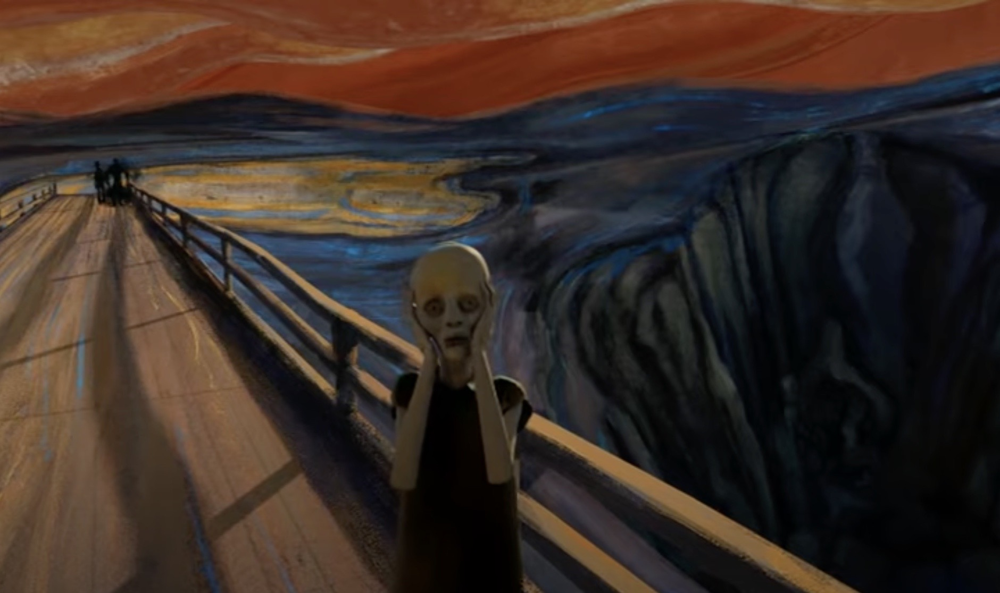
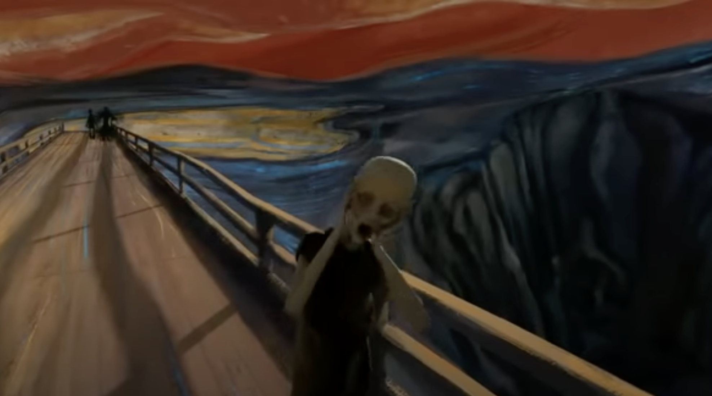
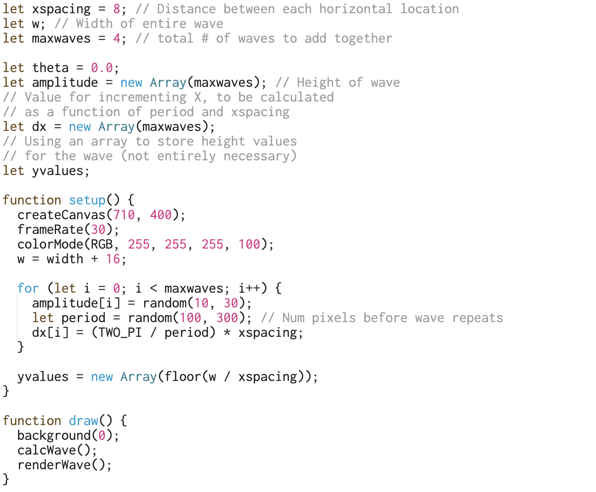
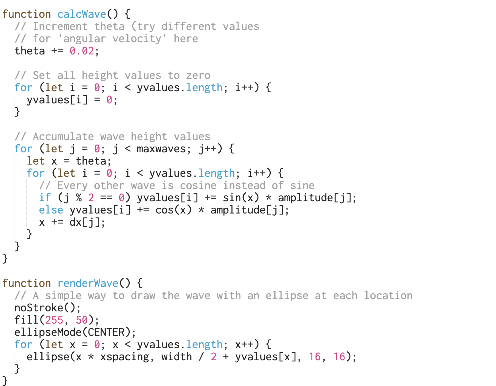

# xzha0557_9103_tut2

# Quiz 8

## Part 1: Imaging Technique
*[Italic Text](https://www.youtube.com/watch?v=nPCD7OciF7A)* 

### “The Scream” can be divided into plenty of abstract and complex wave lines filling with different colours, this principle provides creative space for the design.  From Image 1 to Image 2, a clear change in body movement of the “ghost” and the wave line in the background could enhance the funny and surprising effects in the image. 

### Compared with the original drawing, the landscape layout opens up more three-dimensional and detailed expression content for the design, and while focusing on abstract line depiction, it also achieves a more realistic feeling. 

### 
### 

## Part 2: Coding Technique

### The coding technique chosen for two combined waves are especially useful for the project, as the wave lines should be illustrated and also be added dynamic elements ideally. With the function of “setup” “draw” “calcWave” “renderWave”, the height and quantity of waves can be customised specifically for the design. Based on the “sin wave” example, this technique is more flexible and allow to explore complex dynamic factors which mainly change in calcWave function. From the railing behind the “ghost” to the curvature of the “ghost”, this coding technique can be a great help in project progress and innovation.

### 
### 
